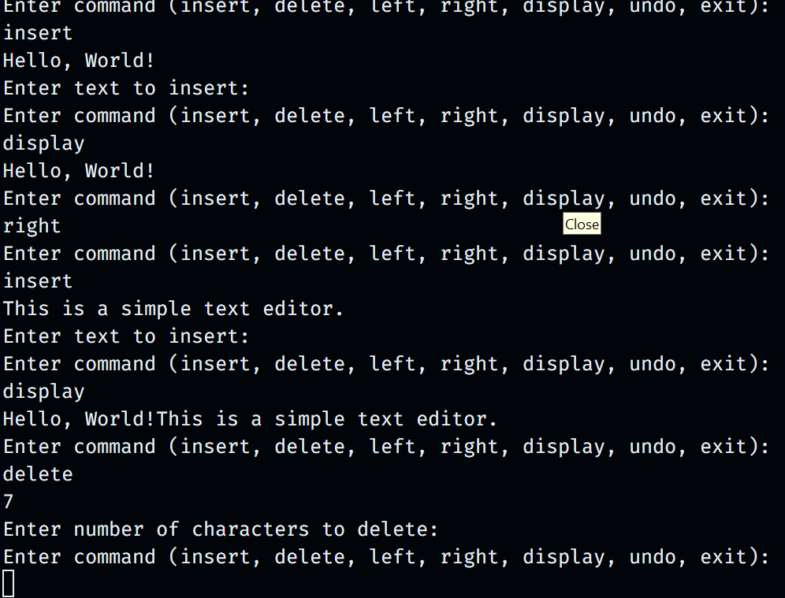

# Simple Text Editor

This is a simple console-based text editor implemented in Java using basic Data Structures and Algorithms (DSA) concepts. The editor allows you to insert and delete text, move the cursor, display the text, and perform undo operations.

## Features

- Insert text at the current cursor position.
- Delete text from the current cursor position.
- Move the cursor left or right.
- Display the current text.
- Undo the last operation.

# Screenshots

## Data Structures Used

- **LinkedList**: For efficient text storage, allowing fast insertions and deletions.
- **Stack**: For managing undo operations, storing previous editor states.

# Commands

Here are the available commands you can use within the editor:

insert: Insert text at the cursor position.
delete: Delete a specified number of characters from the cursor position.
left: Move the cursor left.
right: Move the cursor right.
display: Display the current text.
undo: Undo the last operation.
exit: Exit the text editor.

# Time and Space Complexity

Insert Text: O(n) time, O(n) space
Delete Text: O(n) time, O(n) space
Move Cursor: O(1) time, O(1) space
Display Text: O(n) time, O(1) space
Undo: O(1) time, O(n) space

# Acknowledgments

Developed as a learning project to explore data structures and algorithms in Java.
Thanks to the Java community for the resources that made this project possible.

# License

This project is licensed under the [MIT License](https://docs.github.com/en/repositories/managing-your-repositorys-settings-and-features/customizing-your-repository/licensing-a-repository) . See the LICENSE file for more details.

# Suvam Mohapatra
